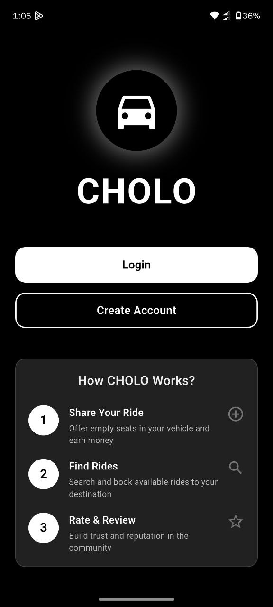
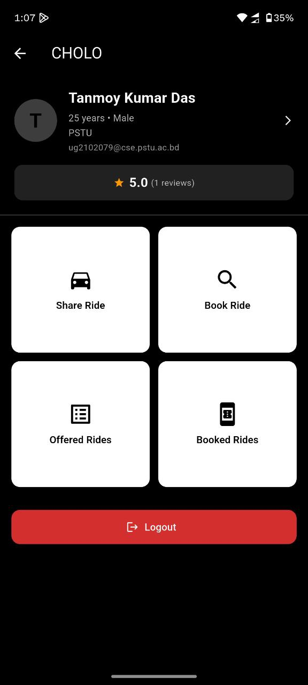
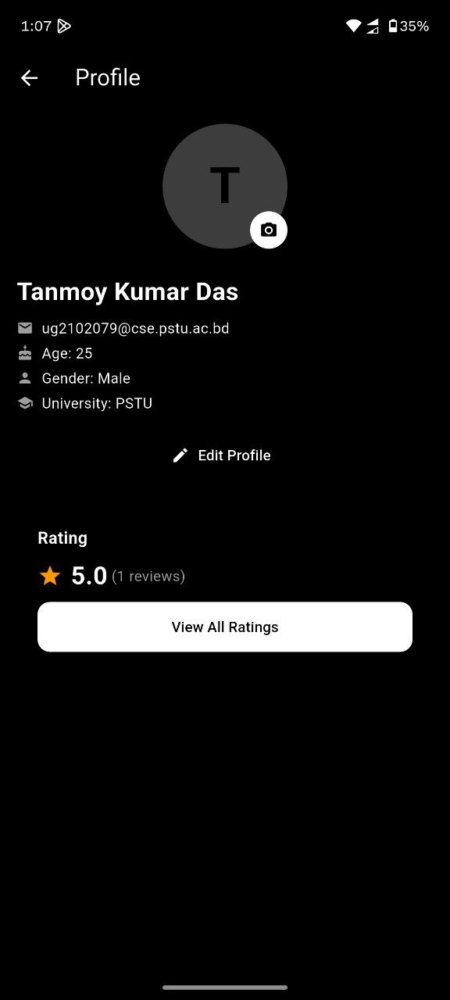
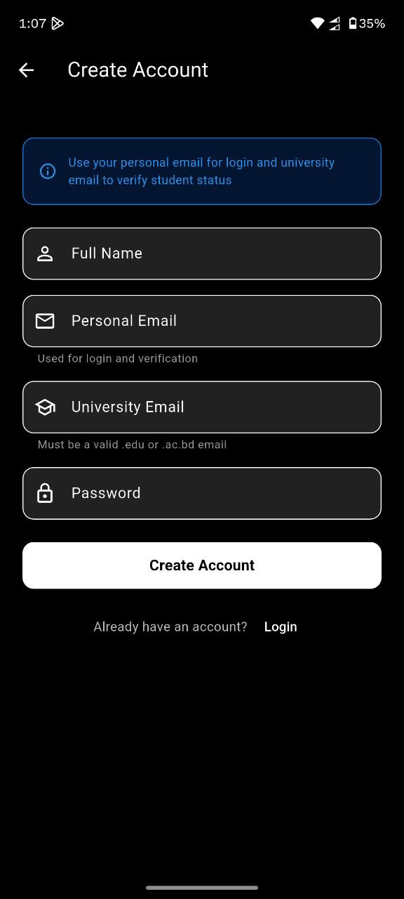

# CHOLO – University Ride Sharing Platform

> A ride-sharing application for university students in Bangladesh

Software Development I (Fifth Semester)   
**This project was developed with assistance from AI tools**

---

## Application Screenshots

<p align="center">
  
  
  
  
</p>

---

## About the Project

CHOLO is a mobile application that enables university students to share rides and reduce commuting costs. Students can offer available seats in their vehicles or book rides from other verified students traveling along similar routes.

### Problem Statement
- University transportation is expensive for students
- Students traveling similar routes lack coordination platforms
- Safety concerns exist with unverified ride-sharing
- Existing platforms don't cater specifically to university needs

### Solution
- University email verification for all users
- Post and search rides along campus routes
- Real-time booking and notifications
- Student-exclusive community platform

---

## Core Features

### Authentication System
- University email registration and verification
- Secure login/logout functionality
- User profile management

### Ride Management
- Offer rides with vehicle details, route, seats, price, and timing
- Search available rides by route
- View driver information and ride details
- Real-time seat availability tracking

### Booking System
- Book available seats
- View booking history
- Track ride status

### Notifications
- Booking confirmations
- Ride status updates

---

## Technology Stack

| Component | Technology |
|-----------|-----------|
| **Framework** | Flutter 3.x |
| **Language** | Dart 3.x |
| **Backend** | Firebase Authentication + Cloud Firestore |
| **Notifications** | flutter_local_notifications |
| **Platform Support** | Android, iOS, Web |

### Dependencies
```yaml
flutter:
sdk: flutter
firebase_core: ^2.24.2
firebase_auth: ^4.15.3
cloud_firestore: ^4.13.6
provider: ^6.1.1
flutter_local_notifications: ^16.3.0
```

---

## Project Structure

```
lib/
├── core/
│   ├── models/
│   ├── services/
│   │   ├── auth_service.dart
│   │   ├── ride_service.dart
│   │   └── notification_service.dart
│   └── providers/
│       └── auth_provider.dart
├── screens/
│   ├── landing_screen.dart
│   ├── login_screen.dart
│   ├── register_screen.dart
│   ├── home_screen.dart
│   ├── offer_ride_screen.dart
│   ├── search_rides_screen.dart
│   └── profile_screen.dart
├── widgets/
└── main.dart

test/
```

---

## Setup Instructions

### Prerequisites
- Flutter SDK 3.0+
- Dart SDK 3.0+
- Android Studio or Xcode
- Firebase account

### Installation Steps

1. Clone the repository
```bash
git clone https://github.com/tanmoykdas/CHOLO.git
cd CHOLO
```

2. Install dependencies
```bash
flutter pub get
```

3. Firebase Configuration
   - Create Firebase project at [Firebase Console](https://console.firebase.google.com/)
   - Enable Email/Password authentication
   - Create Cloud Firestore database
   - Add Android app and download `google-services.json` to `android/app/`
   - Add iOS app and download `GoogleService-Info.plist` to `ios/Runner/`

4. Configure FlutterFire
```bash
dart pub global activate flutterfire_cli
flutterfire configure
```

5. Run the application
```bash
flutter run
```

---

## Database Schema

### Users Collection
```
users/{userId}
├── name: string
├── email: string
├── universityEmail: string
├── emailVerified: boolean
├── phoneNumber: string
├── createdAt: timestamp
└── isAdmin: boolean
```

### Rides Collection
```
rides/{rideId}
├── ownerId: string
├── ownerName: string
├── vehicleType: string
├── route: string
├── startLocation: string
├── endLocation: string
├── totalSeats: number
├── availableSeats: number
├── pricePerSeat: number
├── rideTime: timestamp
├── status: string
└── createdAt: timestamp
```

### Bookings Collection
```
bookings/{bookingId}
├── rideId: string
├── userId: string
├── riderId: string
├── seatsBooked: number
├── totalPrice: number
├── status: string
└── createdAt: timestamp
```

---

## Security

Firestore security rules ensure:
- Users can only modify their own profiles
- Authenticated users can create rides
- Only ride owners can update/delete their rides
- Only booking owners can manage their bookings

```javascript
rules_version = '2';
service cloud.firestore {
  match /databases/{database}/documents {
    function isAuthenticated() {
      return request.auth != null;
    }
    
    function isOwner(userId) {
      return isAuthenticated() && request.auth.uid == userId;
    }
    
    match /users/{userId} {
      allow read: if isAuthenticated();
      allow create: if isAuthenticated() && request.auth.uid == userId;
      allow update, delete: if isOwner(userId);
    }
    
    match /rides/{rideId} {
      allow read: if true;
      allow create: if isAuthenticated();
      allow update, delete: if isAuthenticated() && resource.data.ownerId == request.auth.uid;
    }
    
    match /bookings/{bookingId} {
      allow read: if isAuthenticated();
      allow create: if isAuthenticated();
      allow update: if isAuthenticated() && resource.data.userId == request.auth.uid;
      allow delete: if isAuthenticated() && resource.data.userId == request.auth.uid;
    }
  }
}
```

---

## Testing

Run tests:
```bash
flutter test
flutter test --coverage
```

Current test files:
- auth_provider_test.dart
- landing_screen_test.dart
- widget_test.dart

---

## Development Status

### Completed
- Application architecture
- Authentication system
- Ride and booking models
- UI screens
- Local notifications
- Unit and widget tests

### In Progress
- Firebase real-time synchronization
- Booking flow validation
- Error handling improvements

### Planned Features
- Google Maps integration
- In-app messaging
- Rating system
- Push notifications
- Ride cancellation system
- Admin panel
- Multi-university support

---

## License

Educational project developed for Software Development I course.  
For academic and educational purposes only.

---

## Developer

**Tanmoy Kumar Das**  
Software Development I (Fifth Semester)

**GitHub:** [@tanmoykdas](https://github.com/tanmoykdas)  
**Repository:** [CHOLO](https://github.com/tanmoykdas/CHOLO)

---

## Acknowledgments

- AI tools for development assistance
- Firebase for backend infrastructure
- Flutter framework
- Course instructors and mentors